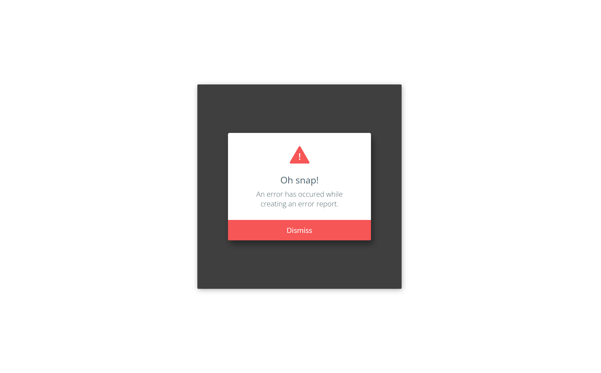

<h1>Error Modal Challenge </h1>

<h2>Challenge Description</h2>

The Error Modal challenge involves creating a styled error message modal using HTML, CSS, and JavaScript. The modal features an icon, title, message, and dismiss button. It appears with a scaling animation and hides when the dismiss button is clicked. This challenge focuses on creating interactive and visually appealing UI components.

<h2>Preview</h2>

<h2>Live Demo</h2>

Check out the live demo <a href="https://codepen.io/Yashi-Singh/pen/QWXNGmL">here</a>.

<h2>Prerequisites</h2>

<ul>
    <li>Basic HTML/CSS/JavaScript Knowledge.</li>
    <li>Familiarity with DOM manipulation and event handling.</li>
</ul>

<h2>Tools Used</h2>

<ol>
    <li>VS Code (You can use any other code editor)</li>
    <li>A modern web browser (Chrome, Firefox, Safari, or Edge).</li>
    <li>Access to an internet connection for resource imports.</li>
</ol>

<h2>Contributing</h2>

If you'd like to contribute to this challenge:

<ol>
    <li>Fork the repository on GitHub.</li>
    <li>Clone your forked repository to your local machine:</li>
    <pre><code>git clone https://github.com/Yashi-Singh-1/Day-41-Error-Modal.git</code></pre>
    <li>Create a new branch for your feature or bug fix:</li>
    <pre><code>git checkout -b feature-name</code></pre>
    <li>Make your changes and commit them with a clear and concise message:</li>
    <pre><code>git commit -m 'Add new feature or fix'</code></pre>
    <li>Push your changes to your forked repository:</li>
    <pre><code>git push origin feature-name</code></pre>
    <li>Open a pull request to the main repository.</li>
    <li>Ensure your pull request includes a detailed description of your changes.</li>
    <li>Respond to any feedback or questions during the review process.</li>
</ol>

We welcome improvements, bug fixes, and additional features that can enhance this Error Modal Challenge .

